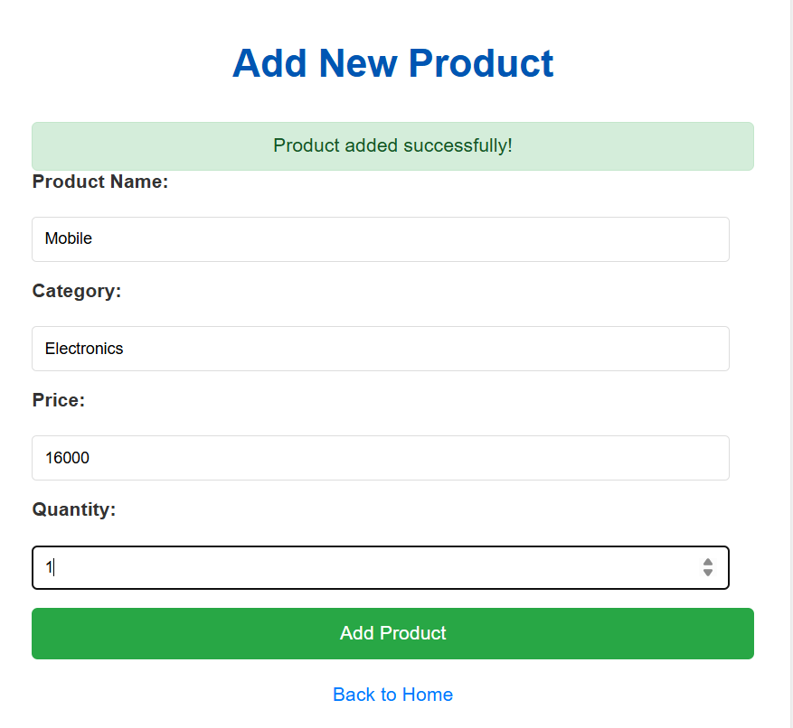
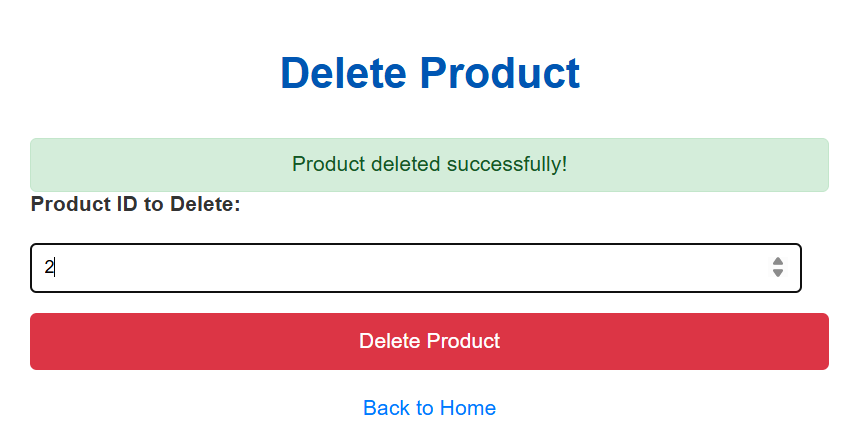
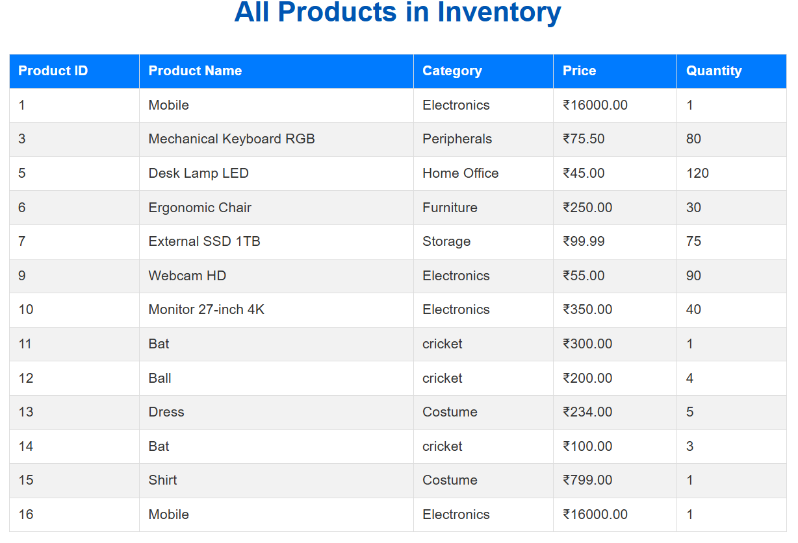

# Product Management System

**Subject Name**: Advanced Java<br>
**Subject Code** : BCS613D<br>
**Name** : K Jeevan Kumar  
**USN** : 4AL22CS067  
**Sem/Section** : VI/B<br> 


---
A comprehensive web application for managing product inventory built with JSP, Servlets, and MySQL following MVC architecture principles.

## 🚀 Features

- **Complete CRUD Operations**: Add, Update, Delete, and Display product details
- **Advanced Search**: Search product records by Product ID (can be extended to Name, Category)
- **Comprehensive Reports**: Generate various reports including:
  - Products with price above a specified amount
  - Products in a specific category
  - Top N products by sales or quantity (assuming sales/quantity data can be derived or added)
- **Input Validation**: Client-side and server-side validation
- **Professional UI**: Bootstrap-based responsive design
- **MVC Architecture**: Clean separation of concerns
- **Database Integration**: MySQL with JDBC connectivity

## 📋 Prerequisites

Before running this application, make sure you have the following installed:

- **Java Development Kit (JDK) 8 or higher**
- **Apache Tomcat 9.0 or higher**
- **MySQL Server 5.7 or XAMP Server**
- **MySQL JDBC Driver (mysql-connector-java)**
- **IDE**: Eclipse (J2EE), IntelliJ IDEA, or any Java IDE
- **Web Browser**: Chrome, Firefox, or Edge

## 🛠️ Project Structure

```
ProductWebApp/
├── src/
│   ├── dao/
│   │   └── ProductDAO.java
│   ├── model/
│   │   └── Product.java
│   └── servlet/
│       ├── AddProductServlet.java
│       ├── UpdateProductServlet.java
│       ├── DeleteProductServlet.java
│       ├── DisplayProductsServlet.java
│       ├── ReportServlet.java
│       └── ReportCriteriaServlet.java
├── WebContent/
│   ├── index.jsp
│   ├── productadd.jsp
│   ├── productupdate.jsp
│   ├── productdelete.jsp
│   ├── productdisplay.jsp
│   ├── reports.jsp
│   ├── report_form.jsp
│   └── report_result.jsp
├── WEB-INF/
│   └── web.xml
└── README.md

```

## 🗄️ Database Setup

### 1. Create Database
```sql
CREATE DATABASE IF NOT EXISTS product_inventory;
USE product_inventory;
```

### 2. Create Table
```sql
CREATE TABLE IF NOT EXISTS Products (
    ProductID INT PRIMARY KEY,
    ProductName VARCHAR(100) NOT NULL,
    Category VARCHAR(50) NOT NULL,
    Price DECIMAL(10,2) NOT NULL,
    Quantity INT NOT NULL
);
```

### 3. Insert Sample Data
```sql
INSERT INTO Products VALUES 
(101, 'Laptop Pro X', 'Electronics', 1200.00, 50),
(102, 'Mechanical Keyboard', 'Accessories', 75.50, 150),
(103, 'Wireless Mouse', 'Accessories', 25.00, 300),
(104, 'Gaming Monitor 27"', 'Electronics', 350.00, 80),
(105, 'USB-C Hub', 'Peripherals', 40.00, 200);
```

## ⚙️ Installation & Setup
Download all the project files and organize them according to the project structure above.

### Step 2: Database Configuration
1. Start your MySQL server
2. Run the database setup scripts provided above
3. Update database credentials in `ProductDAO.java`:
```java
  connection = DriverManager.getConnection(
  "jdbc:mysql://localhost:3306/product_inventory",
  "your_username",
  "your_password"
  );
```

### Step 3: Add MySQL JDBC Driver
1. Download MySQL Connector/J from the official MySQL website
2. Add the JAR file to your project's `WEB-INF/lib` directory
3. If using an IDE, add it to your build path

### Step 4: Deploy to Tomcat
1. Create a new Dynamic Web Project in your IDE
2. Copy all source files to the appropriate folders
3. Deploy the project to Tomcat server
4. Start the Tomcat server

### Step 5: Access the Application
Open your web browser and navigate to:
```
http://localhost:8080/MarkWebApp/
```

## 🖼️ Screenshots

### 🏠 Home Page


### ➕ Add Marks Page


### 🔍 Search Student


### ❌ Delete Details


### 🆕 Update Details


### 📋 Display Marks


## 🎯 Usage Application

### Adding New Products

1. Navigate to "Add Product" from the main menu
2. Fill in all required fields:
- Product ID (unique identifier)
- Product Name (max 100 characters)
- Category (select from dropdown or input text)
- Price (decimal value)
- Quantity (integer)
Click "Add Product"

### Updating Product Details

1. Go to "Update Product"
2. Search for a product by ID
3. Modify the displayed information
4. Click "Update Product"

### Deleting Obsolete Products
1. Go to "Delete Product"
2. Search for a product by ID
3. Confirm deletion by checking the confirmation box
4. Click "Delete Product"

### Displaying Product List
1. Go to "Display Products"
2. Either view all records or search by specific Product ID
3. Use the action buttons to Edit or Delete records

### Generating Reports
1. Go to "Generate Reports"
2. Select report type:
- Products Above Price: Enter minimum price amount
-  Products by Category: Select category
-  Top N Products: Enter number of top products (by quantity or sales, depending on implementation)
3. Click "Generate Report"
4. View results with statistics and print option

## 🔧 Technical Features

### Input Validation
- Client-side: JavaScript validation with Bootstrap
- Server-side: Comprehensive validation in servlets
- Database constraints: Primary key and NOT NULL constraints

### Error Handling
- Try-catch blocks for database operations
- User-friendly error messages
- Graceful handling of invalid inputs

### Security Features
- Prepared statements to prevent SQL injection
- Input validation
- Session management

### Responsive Design
- Bootstrap 5.3 framework
- Styling with hover effects
- Print-friendly report layouts


### 🧪 Testing the Application

### ✅ Test Cases to Verify:

1. **Add Operations**  
   - Add valid product records  
   - Try adding duplicate Product IDs (should fail)  
   - Test input validation:  
     - Empty fields  
     - Invalid price (non-numeric or negative)  
     - Invalid quantity (non-integer or negative)  

2. **Update Operations**  
   - Update existing product records  
   - Try updating non-existent Product ID  
   - Test field validation:  
     - Empty or invalid fields  
     - No changes submitted  

3. **Delete Operations**  
   - Delete existing product records  
   - Try deleting non-existent Product ID  
   - Test confirmation mechanism before deletion  

4. **Display Operations**  
   - View all product records  
   - Search by valid Product ID  
   - Search by invalid Product ID (should return 'not found' or similar)  

5. **Report Generation**  
   - Generate all three types of reports  
   - Test with different filter or criteria values  
   - Verify accuracy of statistics calculations (e.g., total value, averages)


## 🎓 Outcomes
This project demonstrates:

- **MVC Architecture**: Clear separation between Model, View, and Controller
- **Database Integration**: CRUD operations with MySQL
- **Web Development**: JSP, Servlets, HTML, CSS, JavaScript
- **Input Validation**: Both client-side and server-side
- **Report Generation**: Dynamic data analysis and presentation
- **Professional UI**: Responsive design with Bootstrap
   
